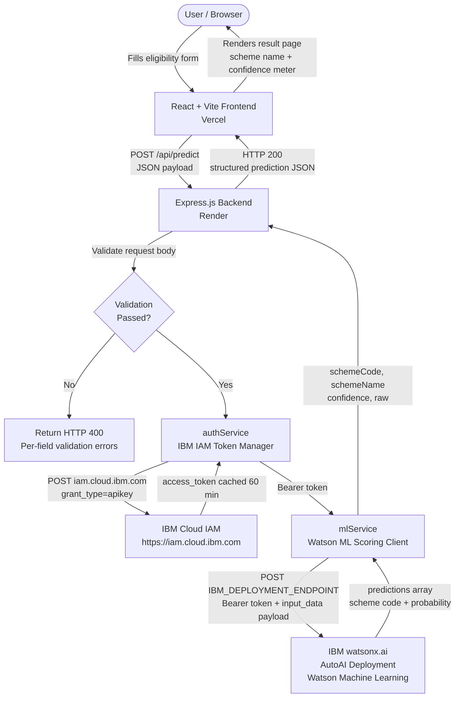

# SahayakAI

### AI-Powered Welfare Scheme Prediction Platform using IBM watsonx.ai AutoAI


---

## Table of Contents

1. [Project Overview](#project-overview)
2. [Key Features](#key-features)
3. [Architecture](#architecture)
4. [Tech Stack](#tech-stack)
5. [Folder Structure](#folder-structure)
6. [Installation Guide](#installation-guide)
7. [Environment Variables](#environment-variables)
8. [API Endpoints](#api-endpoints)
9. [Screenshots](#screenshots)
10. [Deployment](#deployment)
11. [Security](#security)
12. [Future Enhancements](#future-enhancements)
13. [Contributing](#contributing)
14. [License](#license)
15. [Author](#author)

---

## Project Overview

India operates one of the largest social welfare systems in the world, with schemes such as the National Social Assistance Programme (NSAP) reaching tens of millions of beneficiaries across every state and district. Despite this scale, a significant gap persists between eligible citizens and their awareness of — or access to — the schemes they qualify for. Welfare officers and frontline workers spend considerable time manually assessing eligibility against multiple overlapping criteria.

**SahayakAI** addresses this problem by applying machine learning to district-level beneficiary data from the NSAP. A model trained via **IBM watsonx.ai AutoAI** analyses demographic and geographic inputs — including state, district, financial year, and beneficiary category breakdowns — and predicts the most relevant welfare scheme for that profile. The prediction is served through a secure Node.js/Express REST API and surfaced in a fast, accessible React frontend.

The platform is designed to assist welfare officers, policy analysts, and NGO workers in making faster, data-driven eligibility assessments, reducing administrative overhead and improving last-mile delivery of government welfare benefits.

---

## Key Features

- **AI-Powered Welfare Scheme Prediction** — Predicts the most applicable NSAP scheme (IGNOAPS, IGNWPS, or IGNDPS) from district-level demographic inputs using a trained IBM AutoAI classification pipeline.
- **IBM watsonx.ai AutoAI Integration** — Automated machine learning pipeline selection, training, and deployment on IBM Watson Machine Learning, accessed via the Watson ML Scoring API.
- **Secure IBM IAM Authentication** — IBM Cloud Identity and Access Management (IAM) tokens are obtained server-side only. API keys are never exposed to the browser.
- **In-Memory Token Caching with Auto-Refresh** — IAM bearer tokens are cached for their full 60-minute lifetime and proactively refreshed 5 minutes before expiry, eliminating per-request IAM round-trips.
- **Automatic 401 Retry** — On receiving an HTTP 401 from IBM AutoAI, the backend invalidates the token cache and retries the scoring request once with a fresh token.
- **Modern React Frontend** — Built with React 19, Vite 8, Tailwind CSS 4, Framer Motion, and Recharts for a responsive, accessible user experience.
- **Express.js REST Backend** — Structured with controllers, services, middleware, and utilities following a clean separation-of-concerns pattern. Secured with Helmet and Morgan.
- **Input Validation** — All prediction request fields are validated server-side before the IBM AutoAI endpoint is contacted, with structured per-field error responses returned to the client.
- **Confidence Score Display** — The prediction response includes a formatted confidence percentage derived from the AutoAI model's probability output.
- **Responsive UI** — Full mobile-to-desktop responsive layout with dark/light theme support.
- **Cloud Deployment** — Frontend deployed to Vercel; backend deployed to Render; ML model hosted on IBM Cloud Watson Machine Learning.
- **Real-Time Prediction** — Sub-second inference round-trips once the IAM token is cached; end-to-end prediction typically completes within 2–4 seconds.

---

## Architecture

The following diagram describes the end-to-end request flow from the user interface to IBM AutoAI and back.



**Request Payload Fields** (sent to AutoAI):
`finyear`, `lgdstatecode`, `statename`, `lgddistrictcode`, `districtname`, `totalbeneficiaries`, `totalmale`, `totalfemale`, `totaltransgender`, `totalsc`, `totalst`, `totalgen`, `totalobc`, `totalaadhaar`, `totalmpbilenumber`

**Predicted Scheme Codes**:

| Code | Scheme Name |
|---|---|
| `IGNOAPS` | Indira Gandhi National Old Age Pension Scheme |
| `IGNWPS` | Indira Gandhi National Widow Pension Scheme |
| `IGNDPS` | Indira Gandhi National Disability Pension Scheme |

---

## Tech Stack

### Frontend

| Technology | Version | Purpose |
|---|---|---|
| React | 19 | UI component library |
| Vite | 8 | Build tool and dev server |
| React Router DOM | 7 | Client-side routing |
| Tailwind CSS | 4 | Utility-first CSS framework |
| Framer Motion | 12 | Animation library |
| Recharts | 3 | Data visualisation / charting |
| Axios | 1.18 | HTTP client |
| Lucide React | 1.24 | Icon library |
| clsx | 2 | Conditional class name utility |

### Backend

| Technology | Version | Purpose |
|---|---|---|
| Node.js | >=18 | JavaScript runtime |
| Express.js | 4 | HTTP server and routing |
| Axios | 1.7 | IBM API HTTP client |
| Helmet | 7 | HTTP security headers |
| Morgan | 1.10 | HTTP request logging |
| dotenv | 16 | Environment variable loading |
| cors | 2.8 | Cross-origin resource sharing |
| nodemon | 3 | Development auto-restart |

### Machine Learning

| Technology | Purpose |
|---|---|
| IBM watsonx.ai AutoAI | Automated pipeline selection, training, and evaluation |
| IBM Watson Machine Learning | Model hosting and scoring endpoint |
| NSAP District Statistics | Training dataset (National Social Assistance Programme) |

### Cloud

| Service | Purpose |
|---|---|
| IBM Cloud | Platform hosting Watson ML and IAM |
| IBM Cloud IAM | API key-based bearer token authentication |
| IBM Watson Machine Learning | AutoAI model deployment and scoring |

### Deployment

| Service | Purpose |
|---|---|
| Vercel | Frontend static hosting with CDN |
| Render | Backend Node.js hosting |

### Version Control

| Tool | Purpose |
|---|---|
| Git | Source version control |
| GitHub | Repository hosting, Issues, and Actions |

---

## Folder Structure

```
sahayakai-project/
├── .github/
│   └── workflows/                  # GitHub Actions CI/CD pipelines
├── assets/
│   ├── banners/                    # Repository banner images
│   ├── logo/                       # Project logo assets
│   └── screenshots/                # Application screenshots
├── docs/
│   ├── api.md                      # API reference documentation
│   ├── architecture.md             # System architecture notes
│   ├── deployment.md               # Deployment guide
│   ├── presentation.md             # Project presentation notes
│   └── user-guide.md               # End-user guide
├── frontend/
│   ├── public/
│   │   ├── manifest.json           # Web app manifest
│   │   └── robots.txt              # Search engine directives
│   ├── src/
│   │   ├── assets/
│   │   │   ├── animations/         # Lottie / CSS animations
│   │   │   ├── icons/              # SVG icon assets
│   │   │   ├── images/             # General image assets
│   │   │   └── logos/              # Logo variants
│   │   ├── components/
│   │   │   ├── assistant/          # AI assistant chat components
│   │   │   │   ├── ChatInput.jsx
│   │   │   │   ├── ChatWindow.jsx
│   │   │   │   └── Message.jsx
│   │   │   ├── common/             # Reusable UI primitives
│   │   │   │   ├── Button.jsx
│   │   │   │   ├── Card.jsx
│   │   │   │   ├── Loader.jsx
│   │   │   │   └── Modal.jsx
│   │   │   ├── dashboard/          # Analytics and statistics
│   │   │   │   ├── AnalyticsTable.jsx
│   │   │   │   ├── Charts.jsx
│   │   │   │   ├── RecentPredictions.jsx
│   │   │   │   └── StatsCard.jsx
│   │   │   ├── layout/             # Page structure components
│   │   │   │   ├── Footer.jsx
│   │   │   │   ├── Layout.jsx
│   │   │   │   ├── Navbar.jsx
│   │   │   │   └── Sidebar.jsx
│   │   │   └── prediction/         # Eligibility and result components
│   │   │       ├── ConfidenceMeter.jsx
│   │   │       ├── DocumentsList.jsx
│   │   │       ├── EligibilityForm.jsx
│   │   │       └── PredictionCard.jsx
│   │   ├── constants/
│   │   │   ├── api.js              # API URL constants
│   │   │   ├── app.js              # Application-wide constants
│   │   │   └── routes.js           # Route path constants
│   │   ├── context/
│   │   │   ├── AppContext.jsx       # Global application state
│   │   │   └── ThemeContext.jsx     # Dark/light theme context
│   │   ├── hooks/
│   │   │   ├── useChat.js           # AI assistant chat hook
│   │   │   ├── usePrediction.js     # Prediction submission hook
│   │   │   └── useTheme.js          # Theme toggle hook
│   │   ├── pages/
│   │   │   ├── About.jsx
│   │   │   ├── Assistant.jsx
│   │   │   ├── Dashboard.jsx
│   │   │   ├── Eligibility.jsx
│   │   │   ├── Home.jsx
│   │   │   ├── NotFound.jsx
│   │   │   └── Result.jsx
│   │   ├── routes/
│   │   │   └── AppRoutes.jsx        # Centralised route definitions
│   │   ├── services/
│   │   │   ├── apiClient.js         # Axios instance and interceptors
│   │   │   ├── mlService.js         # Prediction API calls
│   │   │   ├── orchestrateService.js
│   │   │   └── watsonService.js
│   │   ├── styles/
│   │   │   └── globals.css          # Global CSS and Tailwind base
│   │   ├── utils/
│   │   │   ├── formatters.js        # Data formatting utilities
│   │   │   ├── helpers.js           # General helper functions
│   │   │   ├── pdfGenerator.js      # PDF export utility
│   │   │   └── validators.js        # Client-side input validators
│   │   ├── App.jsx                  # Root application component
│   │   └── main.jsx                 # React entry point
│   ├── .env.example
│   ├── eslint.config.js
│   ├── package.json
│   └── vite.config.js
├── backend/
│   ├── src/
│   │   ├── config/
│   │   │   └── env.js               # Environment variable loader and validator
│   │   ├── controllers/
│   │   │   └── predictionController.js  # POST /api/predict handler
│   │   ├── middleware/
│   │   │   ├── errorHandler.js      # Global error handler
│   │   │   ├── notFound.js          # 404 handler
│   │   │   └── requestLogger.js     # Per-request ID logger
│   │   ├── routes/
│   │   │   ├── healthRoutes.js      # GET /api/health
│   │   │   └── predictionRoutes.js  # POST /api/predict
│   │   ├── services/
│   │   │   ├── authService.js       # IBM IAM token manager (cached)
│   │   │   └── mlService.js         # Watson ML scoring client
│   │   ├── utils/
│   │   │   ├── logger.js            # Structured logger
│   │   │   ├── response.js          # Standardised JSON response helpers
│   │   │   └── schemeMapper.js      # Scheme code to full name mapper
│   │   ├── app.js                   # Express application factory
│   │   └── server.js                # HTTP server entry point
│   ├── .env.example
│   └── package.json
├── .gitignore
├── LICENSE
└── README.md
```

---

## Installation Guide

### Prerequisites

- **Node.js** >= 18.0.0
- **npm** >= 9.0.0
- An **IBM Cloud** account with a Watson Machine Learning service instance
- A deployed **IBM AutoAI** model with a scoring endpoint URL

---

### 1. Clone the Repository

```bash
git clone https://github.com/harsh-parit/sahayakai.git
cd sahayakai-project
```

---

### 2. Frontend Setup

```bash
cd frontend
npm install
```

---

### 3. Backend Setup

```bash
cd ../backend
npm install
```

---

### 4. Environment Variables

Copy the example files and fill in your credentials.

**Frontend:**

```bash
cp frontend/.env.example frontend/.env
```

**Backend:**

```bash
cp backend/.env.example backend/.env
```

Refer to the [Environment Variables](#environment-variables) section for the complete list of required values.

---

### 5. Run the Backend

```bash
cd backend
npm run dev
```

The API server starts on `http://localhost:5000` by default.

---

### 6. Run the Frontend

```bash
cd frontend
npm run dev
```

The development server starts on `http://localhost:5173` by default.

---

## Environment Variables

### Frontend — `frontend/.env`

| Variable | Description | Example |
|---|---|---|
| `VITE_API_URL` | Base URL of the backend REST API | `http://localhost:5000` |

---

### Backend — `backend/.env`

| Variable | Required | Description | Example |
|---|---|---|---|
| `IBM_API_KEY` | Yes | IBM Cloud API key. Generate at [cloud.ibm.com/iam/apikeys](https://cloud.ibm.com/iam/apikeys) | `abc123...` |
| `IBM_DEPLOYMENT_ENDPOINT` | Yes | Full Watson ML scoring URL for your AutoAI deployment | `https://us-south.ml.cloud.ibm.com/ml/v4/deployments/<id>/predictions?version=2021-05-01` |
| `IBM_PROJECT_ID` | No | IBM Cloud project ID, required for some deployment types | `xxxxxxxx-xxxx-xxxx-xxxx-xxxxxxxxxxxx` |
| `IBM_REGION` | No | IBM Cloud region (default: `us-south`) | `us-south` |
| `PORT` | No | Port the Express server listens on (default: `5000`) | `5000` |
| `CORS_ORIGINS` | No | Comma-separated list of allowed frontend origins | `http://localhost:5173,https://sahayakai.vercel.app` |

The backend validates `IBM_API_KEY` and `IBM_DEPLOYMENT_ENDPOINT` at startup and exits with code 1 if either is missing, preventing the server from running in a broken state.

---

## API Endpoints

All endpoints are prefixed with `/api`.

---

### GET /api/health

Returns server status, uptime, version, Node.js version, and the current environment. Used by uptime monitors, load balancer liveness probes, and CI/CD readiness checks.

**Request:**

```http
GET /api/health
```

**Response — 200 OK:**

```json
{
  "success": true,
  "data": {
    "status": "ok",
    "uptime": 3842,
    "timestamp": "2024-11-15T10:22:34.501Z",
    "version": "1.0.0",
    "node": "v20.11.0",
    "env": "production"
  }
}
```

---

### POST /api/predict

Accepts district-level demographic data, validates all fields server-side, and returns a welfare scheme prediction from the IBM AutoAI deployment.

**Request:**

```http
POST /api/predict
Content-Type: application/json
```

```json
{
  "finyear": "2023-2024",
  "lgdstatecode": 27,
  "statename": "Maharashtra",
  "lgddistrictcode": 519,
  "districtname": "Pune",
  "totalbeneficiaries": 14820,
  "totalmale": 6200,
  "totalfemale": 8590,
  "totaltransgender": 30,
  "totalsc": 3100,
  "totalst": 980,
  "totalgen": 7200,
  "totalobc": 3540,
  "totalaadhaar": 14300,
  "totalmpbilenumber": 12100
}
```

**Response — 200 OK (Prediction Successful):**

```json
{
  "success": true,
  "prediction": {
    "schemeCode": "IGNOAPS",
    "schemeName": "Indira Gandhi National Old Age Pension Scheme",
    "confidence": "92.4%",
    "raw": {
      "predictions": [
        {
          "fields": ["prediction", "probability"],
          "values": [["IGNOAPS", [0.04, 0.92, 0.04]]]
        }
      ]
    }
  },
  "timestamp": "2024-11-15T10:22:36.812Z"
}
```

**Response — 400 Bad Request (Validation Error):**

```json
{
  "success": false,
  "message": "Request body validation failed. Please correct the highlighted fields.",
  "error": "VALIDATION_ERROR",
  "details": {
    "statename": "statename is required and must be a non-empty string.",
    "totalbeneficiaries": "totalbeneficiaries must be a non-negative number."
  },
  "timestamp": "2024-11-15T10:22:36.812Z"
}
```

**Response — 502 Bad Gateway (IBM Service Error):**

```json
{
  "success": false,
  "message": "IBM Cloud authentication failed. Verify IBM_API_KEY in .env.",
  "error": "IBM_AUTH_ERROR",
  "timestamp": "2024-11-15T10:22:36.812Z"
}
```

**IBM Error Codes:**

| Code | HTTP Status | Description |
|---|---|---|
| `IBM_AUTH_ERROR` | 502 | Invalid or expired IBM API key |
| `IBM_TIMEOUT` | 504 | AutoAI scoring timed out after 30 seconds |
| `IBM_UNREACHABLE` | 502 | Cannot connect to the IBM deployment endpoint |
| `IBM_NOT_FOUND` | 502 | Deployment endpoint URL is incorrect or deleted |
| `IBM_RATE_LIMIT` | 429 | IBM AutoAI rate limit exceeded |
| `IBM_SERVER_ERROR` | 502 | IBM Watson ML returned a 5xx error |
| `VALIDATION_ERROR` | 400 | One or more request fields failed validation |

---

## Screenshots

### Home Page

The landing page introduces SahayakAI, explains the platform purpose, and provides navigation to the eligibility checker and dashboard.

> `assets/screenshots/home.png`

---

### Eligibility Checker

The eligibility form collects district-level demographic inputs including state, district, financial year, beneficiary counts by gender and category, and Aadhaar/mobile coverage.

> `assets/screenshots/eligibility.png`

---

### Prediction Result

Displays the predicted welfare scheme name, scheme code, formatted confidence percentage via a visual confidence meter, and the list of relevant documentation requirements.

> `assets/screenshots/result.png`

---

### Dashboard

Analytics view showing recent predictions, scheme distribution charts powered by Recharts, and aggregate statistics for sessions conducted via the platform.

> `assets/screenshots/dashboard.png`

---

### IBM AutoAI Deployment

The deployed IBM AutoAI pipeline on IBM Watson Machine Learning, showing model evaluation metrics and the active scoring endpoint used by the backend.

> `assets/screenshots/autoai-deployment.png`

---

## Deployment

### Frontend — Vercel

1. Import the repository into [Vercel](https://vercel.com).
2. Set the **Root Directory** to `frontend`.
3. Set the **Build Command** to `npm run build`.
4. Set the **Output Directory** to `dist`.
5. Add the environment variable `VITE_API_URL` pointing to your deployed backend URL.
6. Deploy. Vercel handles CDN distribution automatically.

---

### Backend — Render

1. Create a new **Web Service** on [Render](https://render.com).
2. Connect your GitHub repository and set the **Root Directory** to `backend`.
3. Set the **Build Command** to `npm install`.
4. Set the **Start Command** to `npm start`.
5. Add all required environment variables (`IBM_API_KEY`, `IBM_DEPLOYMENT_ENDPOINT`, etc.) in the Render environment settings.
6. Set `CORS_ORIGINS` to include your Vercel frontend URL.
7. Deploy. Render provisions a Node.js environment automatically.

---

### IBM Cloud Deployment

1. Log in to [IBM Cloud](https://cloud.ibm.com) and open **Watson Studio**.
2. Create or open an existing project and navigate to **AutoAI Experiment**.
3. Upload the NSAP district beneficiary dataset and configure the prediction column.
4. Run the AutoAI experiment; select the best-performing pipeline and save it as a model.
5. Deploy the saved model to **Watson Machine Learning** as an **Online Deployment**.
6. Copy the **Scoring Endpoint URL** from the deployment details page.
7. Set `IBM_DEPLOYMENT_ENDPOINT` in your backend environment to this URL.
8. Generate an IBM Cloud API key at [cloud.ibm.com/iam/apikeys](https://cloud.ibm.com/iam/apikeys) and set `IBM_API_KEY` accordingly.

---

## Security

### IBM IAM Authentication is Backend-Only

All communication with IBM Cloud IAM and IBM Watson Machine Learning is handled exclusively in the Express.js backend. The IBM Cloud API key (`IBM_API_KEY`) is stored as a server-side environment variable and is **never transmitted to or accessible from the browser**.

**Token flow:**

1. On the first prediction request, `authService.getAccessToken()` exchanges the API key for a short-lived IAM bearer token by POSTing to `https://iam.cloud.ibm.com/identity/token`.
2. The bearer token is cached in server memory for its full 60-minute lifetime and proactively refreshed 5 minutes before expiry.
3. If IBM AutoAI returns an HTTP 401, the token cache is invalidated and a single retry with a fresh token is performed automatically.
4. The bearer token is attached to the `Authorization` header of requests sent from the backend to the Watson ML scoring endpoint. It is never included in any response sent to the frontend.

**What the browser never sees:**

- `IBM_API_KEY`
- IBM IAM bearer tokens
- The IBM deployment endpoint URL
- IBM project or space identifiers

The frontend communicates only with the application's own backend (`/api/predict`). Credentials and IBM service URLs are opaque to the client at all times.

---

## Future Enhancements

- **IBM watsonx.ai AI Assistant** — Integrate an IBM watsonx.ai language model as an in-application assistant capable of answering citizen questions about scheme eligibility criteria, required documents, and application procedures.
- **IBM Orchestrate Integration** — Automate multi-step welfare application workflows using IBM Orchestrate, reducing manual data entry for field officers.
- **Analytics Dashboard** — Expand the existing dashboard with time-series prediction trends, district-level heatmaps, and scheme distribution breakdowns exportable as CSV.
- **PDF Report Generation** — Generate downloadable PDF eligibility reports per prediction, including scheme details, applicant inputs, confidence score, and required documentation list.
- **Role-Based Authentication** — Introduce JWT-based authentication with distinct roles for citizens, welfare officers, district administrators, and system administrators with appropriate access controls.
- **Government API Integration** — Connect to official NSAP and Aadhaar verification APIs to enable real-time identity and eligibility cross-referencing.

---

## Contributing

Contributions are welcome. Please follow the steps below.

1. Fork the repository.
2. Create a feature branch:
   ```bash
   git checkout -b feature/your-feature-name
   ```
3. Make your changes and commit with a descriptive message:
   ```bash
   git commit -m "feat: add your feature description"
   ```
4. Push to your fork:
   ```bash
   git push origin feature/your-feature-name
   ```
5. Open a Pull Request against the `main` branch with a clear description of the changes and the problem they solve.

Please ensure your code follows the existing style, passes linting (`npm run lint` in both `frontend/` and `backend/`), and does not introduce new console warnings or errors.

---

## License

This project is licensed under the **MIT License**.

Copyright (c) 2024 SahayakAI

See the [LICENSE](./LICENSE) file for the full license text.

---

## Author

**Harsh Rakesh Parit**

BCA Final Year Student
Edunet Foundation x IBM SkillsBuild Internship

- GitHub: [github.com/harsh-parit](https://github.com/harsh-parit)
- LinkedIn: [linkedin.com/in/harsh-parit](https://linkedin.com/in/harsh-parit/)

---

If you found this project useful, please consider giving it a star.
